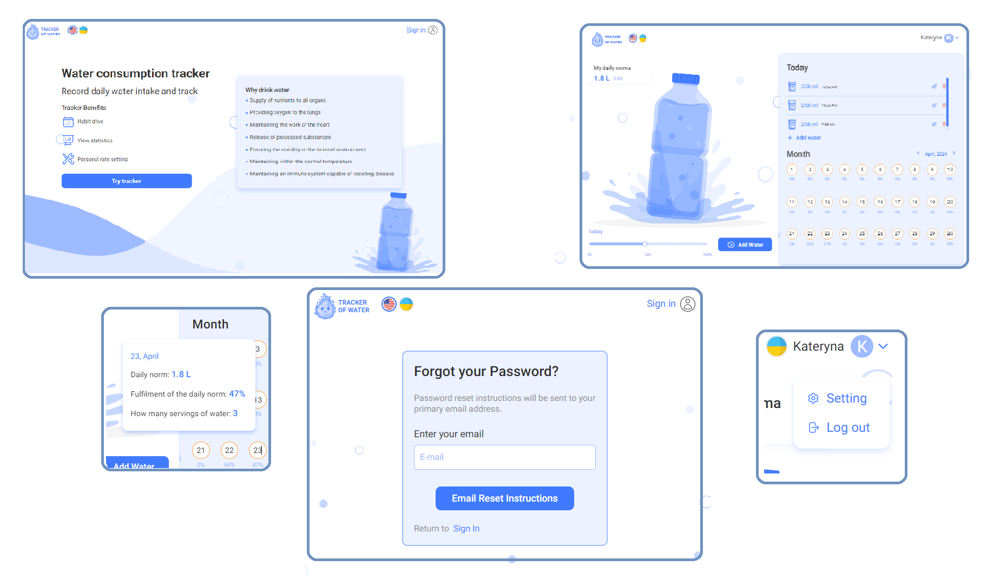
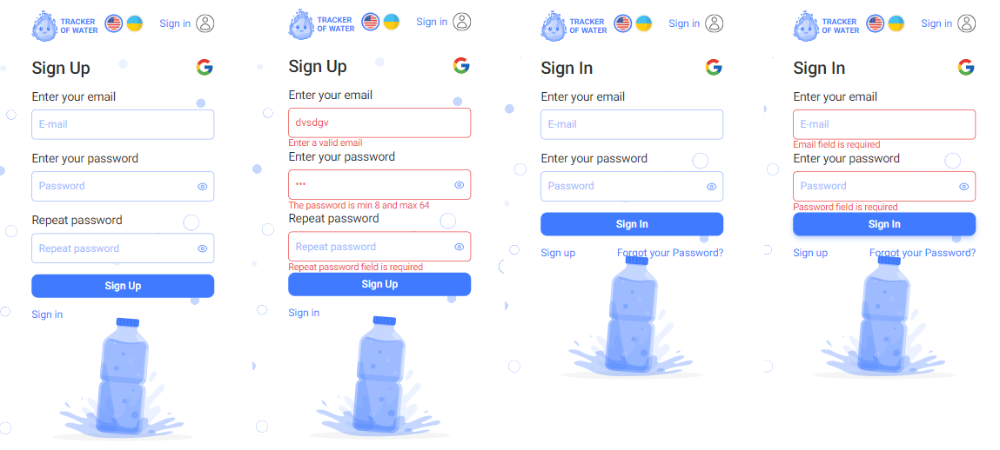
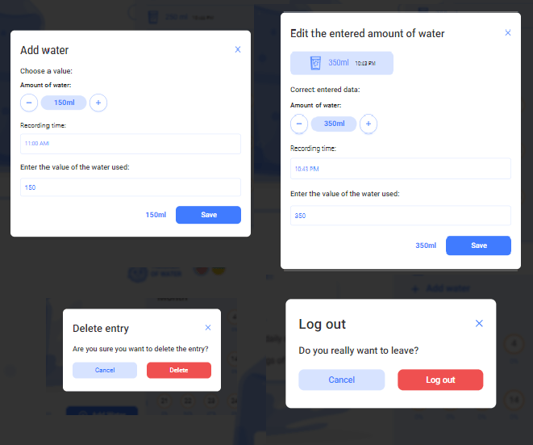
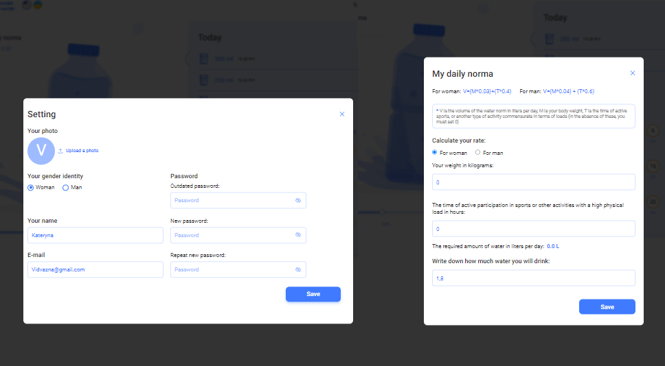

# <p>Wter Tracker</p>

<p>
    <a href="https://developer.mozilla.org/en-US/docs/Web/JavaScript"></a>
    <a href="https://react.dev/"></a>
    <a href="https://redux.js.org/"></a>
    <a href="https://redux-toolkit.js.org/"></a>
    <a href="https://redux.js.org/usage/writing-logic-thunks"></a>
    <a href="https://www.npmjs.com/package/cloudinary"></a>
    <a href="https://axios-http.com/docs/intro"></a>
    <a href="https://www.npmjs.com/package/yup"></a>
    <a href="https://ant.design/"></a>
    <a href="https://www.npmjs.com/package/dayjs"></a>
    <a href="https://formik.org/docs/overview"></a>
    <a href="https://react.i18next.com/"></a>
    <a href="https://www.npmjs.com/package/redux-persist"></a>
    <a href="https://www.npmjs.com/package/react-toastify"></a>
    <a href="https://www.npmjs.com/package/reselect"></a>
    <a href="https://www.npmjs.com/package/react-spinners"></a>
    <a href="https://www.npmjs.com/package/react-icons"></a>
</p>

---



---

## Description

The Water Tracker is a web application that allows users to track their daily water intake and maintain a sufficient water balance. It becomes an invaluable assistant for people with an active lifestyle, athletes, activists, as well as for people with certain health issues when it is necessary to limit water consumption and strictly adhere to a prescribed drinking regimen by a doctor.

---

 

---

## Features

- **_Bilingualism_** of the application: Ukrainian and English languages
- user registration, login, verification
- **_Google authentication_**
- user data editing: name, email, gender, avatar upload, password update
- **_calculation of the daily water norm_** depending on weight and physical activity
- recording consumed water portions throughout the day, their editing, and deletion
- **_calculation of the percentage of consumed water_** to the daily water norm
- **_calendar with records of water consumption_** for each day as a percentage of the daily norm

---



---



---

## Usage

For your convenience, you can use the following email and password to log in:

```
gomaki3592@dxice.com
password
```

---

## Live page

**_<a href="water-tracker-pi.vercel.app">Water Tracker</a>_**

---

## Installation

To run this project, you need to install <a href="https://nodejs.org/en">Node.js v20.12.2</a>

#### 1. Clone the project repository

```
    git clone https://github.com/Kateryna-Borysenko/water-tracker.git
```

#### 2. Install dependencies

```
    npm i
```

#### 3. Start the server

```
    npm run dev
```

---

**_Enjoy your time and have a great experience using Water Tracker!_**

---
